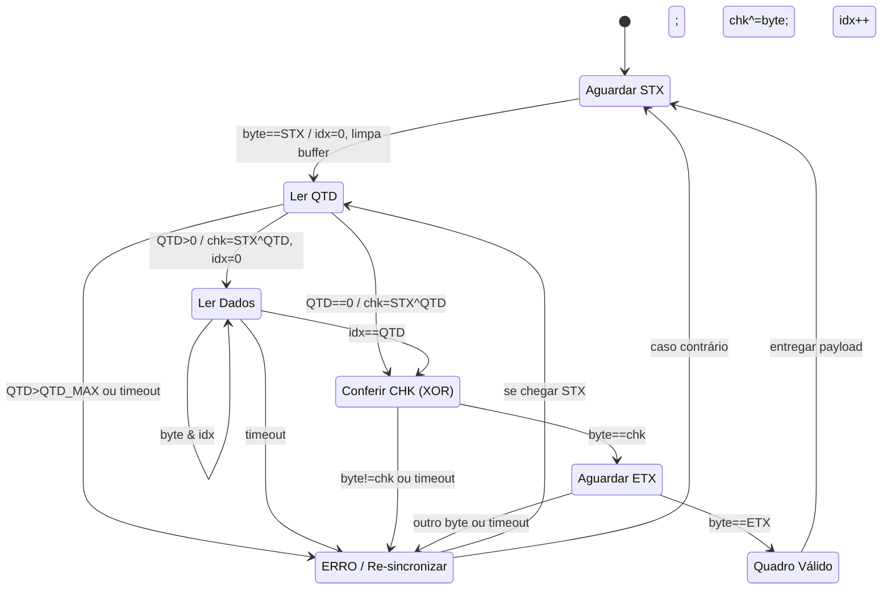

# FSM RX (Mermaid) — Protocolo STX, QTD, DADOS, CHK, ETX

```mermaid
stateDiagram-v2
    direction TB

    [*] --> RX_AGUARDA_STX
    RX_AGUARDA_STX: Aguardar STX

    RX_LE_TAM: Ler QTD
    RX_LE_DADOS: Ler Dados
    RX_LE_CHK: Conferir CHK (XOR)
    RX_LE_ETX: Aguardar ETX
    RX_OK: Quadro Válido
    RX_ERRO: ERRO / Re-sincronizar

    RX_AGUARDA_STX --> RX_LE_TAM: byte==STX / idx=0, limpa buffer
    RX_LE_TAM --> RX_ERRO: QTD>QTD_MAX ou timeout
    RX_LE_TAM --> RX_LE_CHK: QTD==0 / chk=STX^QTD
    RX_LE_TAM --> RX_LE_DADOS: QTD>0 / chk=STX^QTD, idx=0

    RX_LE_DADOS --> RX_LE_DADOS: byte & idx<QTD / armazena; chk^=byte; idx++
    RX_LE_DADOS --> RX_LE_CHK: idx==QTD
    RX_LE_DADOS --> RX_ERRO: timeout

    RX_LE_CHK --> RX_LE_ETX: byte==chk
    RX_LE_CHK --> RX_ERRO: byte!=chk ou timeout

    RX_LE_ETX --> RX_OK: byte==ETX
    RX_LE_ETX --> RX_ERRO: outro byte ou timeout

    RX_OK --> RX_AGUARDA_STX: entregar payload

    RX_ERRO --> RX_LE_TAM: se chegar STX
    RX_ERRO --> RX_AGUARDA_STX: caso contrário
```
