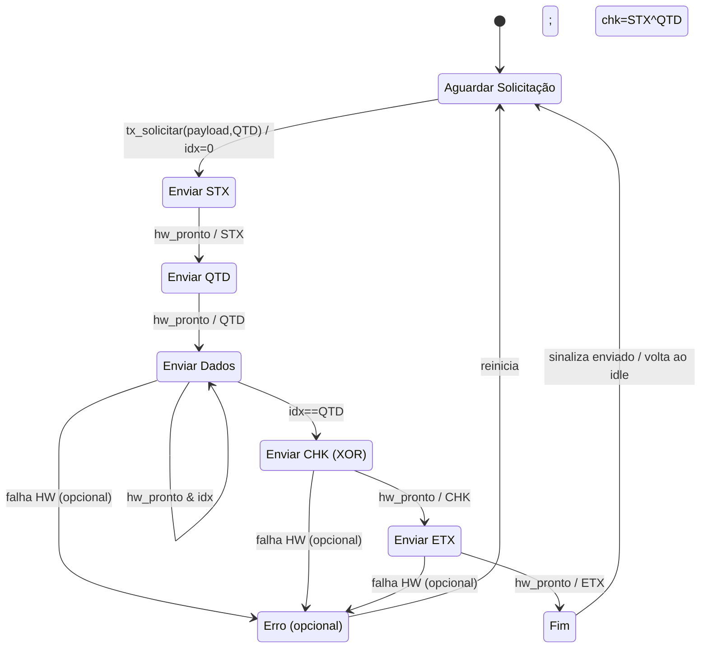

# FSM TX (Mermaid) — Protocolo STX, QTD, DADOS, CHK, ETX

```mermaid
stateDiagram-v2
    direction TB

    [*] --> TX_AGUARDA
    TX_AGUARDA: Aguardar Solicitação
    TX_ENVIA_STX: Enviar STX
    TX_ENVIA_TAM: Enviar QTD
    TX_ENVIA_DADOS: Enviar Dados
    TX_ENVIA_CHK: Enviar CHK (XOR)
    TX_ENVIA_ETX: Enviar ETX
    TX_FIM: Fim
    TX_ERRO: Erro (opcional)

    TX_AGUARDA --> TX_ENVIA_STX: tx_solicitar(payload,QTD) / idx=0; chk=STX^QTD
    TX_ENVIA_STX --> TX_ENVIA_TAM: hw_pronto / STX
    TX_ENVIA_TAM --> TX_ENVIA_DADOS: hw_pronto / QTD

    TX_ENVIA_DADOS --> TX_ENVIA_DADOS: hw_pronto & idx<QTD / dado, chk^=dado, idx++
    TX_ENVIA_DADOS --> TX_ENVIA_CHK: idx==QTD
    TX_ENVIA_DADOS --> TX_ERRO: falha HW (opcional)

    TX_ENVIA_CHK --> TX_ENVIA_ETX: hw_pronto / CHK
    TX_ENVIA_CHK --> TX_ERRO: falha HW (opcional)

    TX_ENVIA_ETX --> TX_FIM: hw_pronto / ETX
    TX_ENVIA_ETX --> TX_ERRO: falha HW (opcional)

    TX_FIM --> TX_AGUARDA: sinaliza enviado / volta ao idle
    TX_ERRO --> TX_AGUARDA: reinicia
```
